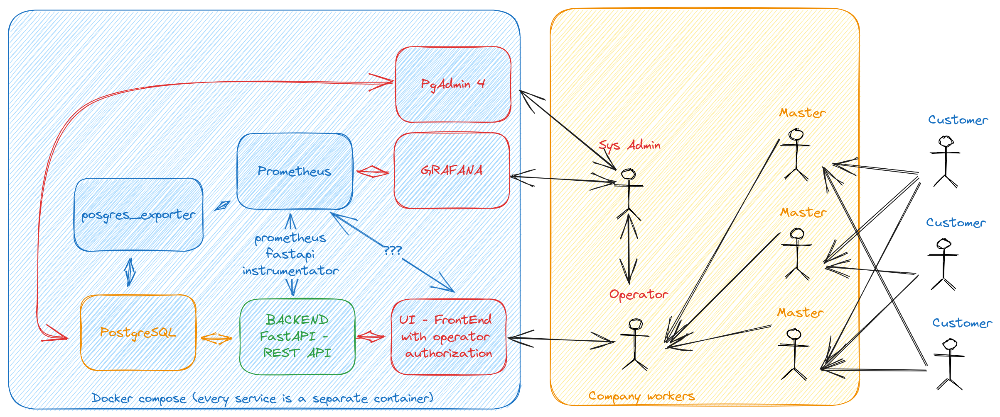

# Автоматизация работы автосервиса - Вариант 9

## Видение архитектуры (v1)



Fix v1.1: Бекенд на FastAPI убран в меру его излишества 

## Пояснительная записка

Пояснительную записку можно найти [здесь](../docs/Пояснительная_записка.pdf)

## Запуск проекта

Для запуска проекта требуется Docker и Docker compose. (Установить можно по инструкции [отсюда](https://www.digitalocean.com/community/tutorials/how-to-install-and-use-docker-compose-on-ubuntu-22-04))

Версии для справки
```bash
quakumei@saturn:~/Desktop/iamjaf/spbstu/PSQLLabs/car_service$ docker -v
Docker version 24.0.6, build ed223bc
quakumei@saturn:~/Desktop/iamjaf/spbstu/PSQLLabs/car_service$ docker compose version
Docker Compose version v2.21.0
```

Непосредственно для запуска проекта требуется 
исполнить две команды:
```bash
docker compose up -d 
make recreate_db # создает базу данных с триггерами и мок-данными
```
После чего веб-интерфейс будет доступен на http://localhost:8501. Также запускаются другие сервисы, в тч. pgadmin на http://localhost:5050. Их полный список можно посмотреть в [docker-compose.yml](docker-compose.yml)

## Автор

Тампио И.С. 5130904/10102, СПбПУ (3 курс)

При возникновении вопросов, доступен в [@Quakumei](https://t.me/Quakumei) 
Или по корпоративной почте tampio.is@edu.spbstu.ru
